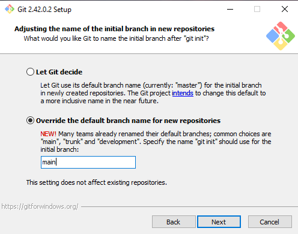

# Usando git na sua casa

## Índice

* [Instalando git](#instalação)
* [Criando um repositorio](#criando-um-repositorio)
* [Fazendo um commit](#fazendo-um-commit)

## Instalação

### Windows

Acesse o site de [download do Git para Windows](https://git-scm.com/download/win) e baixe o `64-bit Git for Windows Setup.` ou `32-bit Git for Windows Setup.` dependendo do seu sistema.

Após ter feito o donwload execute o instalador e clique em `Next` até chegar na seguinte etapa, a primeira opção virá selecionada mas vamos selecionar a segunda e manter main na caixa de texto.



De `Next` para as demais etapas e por fim `Finish`. Pronto, agora você tem Linux instalado no seu computador e pode usa-lo para gerenciar seus repositorios e projetos.

### Linux

Na maioria dos sistemas Linux o git já vem instalado, mas para verificarmos mesmo digite o seguinte comando no terminal:

```bash
git --version
```
<!-- IMAGEM DA VERSAO AQUI -->

Caso não apareça utilize o seguinte comando para fazer a instalação

```bash
sudo apt-get install git
```

## Configuração
Diferente dos PCs nos laborátorios, a configuração que fazemos no nosso computador será feita uma única vez. Vamos configurar seu nome de usuario e email no git, para isso digite no terminal os seguintes comandos:

```bash
git config --global user.name "Seu usuario"
git config --global user.email "Seu email"
```

## Criando um repositorio

Após ter criado uma conta basta clicar no botão `` New `` no canto superior esquerdo para criar um novo repositorio.


GitHub vai mostrar várias opções, por hora vamos apenas colocar um nome para o repositorio, selecione a caixinha ``Add a README file ``, escolha se ele será publico ou privado e por fim Create repository.


Agora que temos nosso repositorio remoto criado vamos adiciona-lo na nossa home. Para isso, cline no botão ``Code`` e copie o link dele:


Apos ter copiado o link do repositorio abra o terminal digite o seguinte comando com o link:

```bash
git clone <link_do_repositorio>
```
Pronto agora seu repositorio do GitHub esta em uma pasta no seu computador.

<!--
Vamos começar criando um repositorio no GitHub

Após ter criado uma conta basta clicar no botão `` New `` no canto superior esquerdo para criar um novo repositorio.


GitHub vai mostrar várias opções, por hora vamos apenas colocar um nome para o repositorio e escolher se ele será publico ou privado.


Pronto, seu repositorio remoto esta criado :D

Ainda precisamos linkar ele a um repositorio local (no seu computador). O GitHub já nos mostra como fazer isso mostrando uma serie de comandos que devemos digitar no terminal. Este é o comando para criar um repositorio local e ele deve ser feito dentro da pasta que deseja criar o repositorio:

```bash
git init
```

Vamos analisar os demais comandos no topico a seguir. Apos isso seu repositorio já está pronto para... <!-- ...


-->
## Fazendo um commit

Agora qualquer alteração que vocês fizer nos arquivos dessa pasta serão rastreados pelo git e você poderá mandar eles para o GitHub.

Para checar o status do seu repositorio, digite:

```bash
git status
```

Existem diversas maneiras de adicionar um arquivo ao seu repositorio, a mais simples é:

```bash
git add .
```


Caso queira adicionar um arquivo que foi modificado em especifico, digite:

```bash
git add <nome_do_arquivo>
```

Obs:
- `` git add * `` também adiciona todos os arquivos da pasta, porém ele não adiciona arquivos que começam com um ponto, como por exemplo `` .gitignore ``.

Para salvar as alterações feitas no repositorio, digite:

```bash
git commit -m "Mensagem do commit"
```

A mensagem do commit é uma mensagem que você escreve para descrever o que foi feito no commit, por exemplo: `` "Adicionado o arquivo tarefa.html" ``.

Para mandar este commit para o GitHub (repositorio remoto), digite:

```bash
git push origin main
```

Para pegar um repositorio remoto e clona-lo para o seu computador, digite:

```bash
git clone <link_do_repositorio>
```
<!-- add image about the link here -->

___
Estes são apenas os comandos basicos, existem muitos outros comandos que podem ser usados para facilitar o seu trabalho, para saber mais sobre eles, acesse a [documentação do git](https://git-scm.com/docs).

Links uteis:
- [Git com Bitbucket Cloud](https://www.atlassian.com/br/git/tutorials/learn-git-with-bitbucket-cloud)