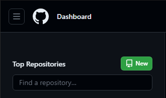
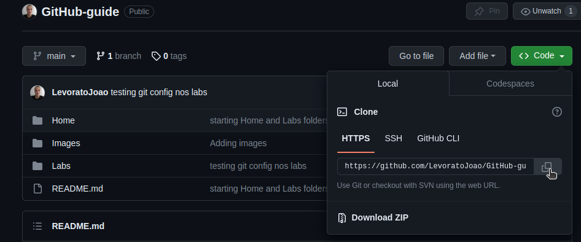

# Usando git nos laboratorios

## Índice

* [Criando um repositorio](#criando-um-repositorio)
* [Configurando o git](#configurando-o-git)
* [Fazendo um commit](#fazendo-um-commit)

## Criando um repositorio

Após ter criado uma conta basta clicar no botão `` New `` no canto superior esquerdo para criar um novo repositorio.



GitHub vai mostrar várias opções, por hora vamos apenas colocar um nome para o repositorio, selecione a caixinha ``Add a README file ``, escolha se ele será publico ou privado e por fim Create repository.


Agora que temos nosso repositorio remoto criado vamos adiciona-lo na nossa home. Para isso, cline no botão ``Code`` e copie o link dele:



Apos ter copiado o link do repositorio abra o terminal na pasta HOME e digite o seguinte comando com o link:

```bash
git clone <link_do_repositorio>
```
Pronto agora seu repositorio do GitHub esta na sua Home, você pode fazer o mesmo processo de clonar o repositorio na sua casa.

## Configurando o git
Para usar git nos laboratorios da UTF usando o Linux precisamos configurar usuario e email do git primeiro. 

Para fazer isso usamos os seguintes comandos:
```bash
git config --local user.name "Seu usuario"
git config --local user.email "Seu email"
```
Como os computadores dos laborátorios resetam sempre quando desligados precisamos fazer a configuração de forma local, por isso o comando recebe o `--local`, em sua casa este comando pode ser feito com `--global`.

## Fazendo um commit
Agora qualquer alteração que vocês fizerem nos arquivos dessa pasta do repositorio serão rastreados pelo git e você poderá mandar eles para o GitHub.

Para checar o status do seu repositorio, digite:

```bash
git status
```

Existem diversas maneiras de adicionar um arquivo ao seu repositorio, a mais simples é:

```bash
git add .
```

Caso queira adicionar um arquivo que foi modificado em especifico, digite:

```bash
git add <nome_do_arquivo>
```

Obs:
- `` git add * `` também adiciona todos os arquivos da pasta, porém ele não adiciona arquivos que começam com um ponto, como por exemplo `` .gitignore ``.

Para salvar as alterações feitas no repositorio, digite:

```bash
git commit -m "Mensagem do commit"
```

A mensagem do commit é uma mensagem que você escreve para descrever o que foi feito no commit, por exemplo: `` "Adicionado o arquivo tarefa.html" ``.

Para mandar este commit para o GitHub (repositorio remoto), digite:

```bash
git push origin main
```